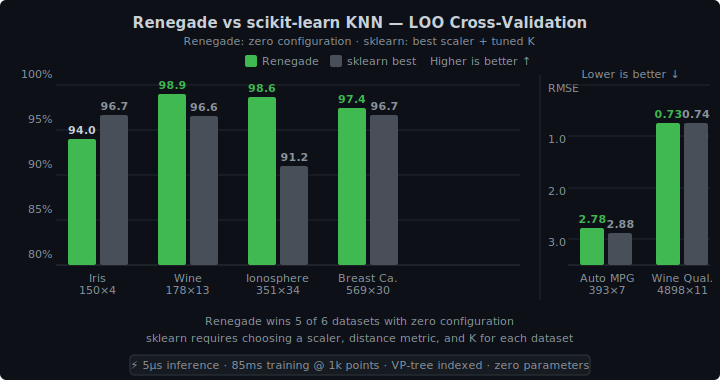

# Renegade

[](https://crates.io/crates/renegade-ml)
[](https://docs.rs/renegade-ml)

A nonparametric supervised learning library for Rust. Zero configuration, competitive with scikit-learn out of the box.

Renegade is a KNN-based learner that **just works** — no hyperparameters to tune, no preprocessing pipeline to configure. It handles mixed numeric and categorical features, automatically selects K, learns which features matter, and indexes data for fast queries. You add data, you get predictions.

## Benchmarks

Leave-one-out cross-validation against scikit-learn's KNN with StandardScaler and tuned K:

<p align="center">
  
</p>

Renegade wins **5 of 6** standard ML datasets with zero configuration. sklearn requires choosing a scaler, distance metric, and K for each dataset.

## Performance

| Data points | Training | Inference | Notes |
|-------------|----------|-----------|-------|
| 100 | 5 ms | **2 µs** | VP-tree indexed |
| 1,000 | 85 ms | **5 µs** | Metric learning + auto K |
| 10,000 | 1.2 s | **5 µs** | VP-tree scales sublinearly |
| 100,000 | ~40 s | **56 µs** | 87× faster than brute force |

- Training is **amortized** — only recomputes when the dataset grows 50%. The VP-tree rebuilds independently every ~20% growth (~15ms at 10k points).
- New data points are **immediately queryable** without retraining.
- Instance weights support recency decay for online learning.

## Quick Start

```bash
cargo add renegade-ml
```

```rust
use renegade_ml::{DataPoint, Renegade};

#[derive(Clone)]
struct Peer {
    distance: f64,     // network distance
    latency_ms: f64,   // recent avg latency
    origin: u8,        // region (categorical)
}

impl DataPoint for Peer {
    fn feature_distances(&self, other: &Self) -> Vec<f64> {
        vec![
            (self.distance - other.distance).abs() / 1.0,       // already [0, 1]
            (self.latency_ms - other.latency_ms).abs() / 500.0, // normalize
            if self.origin == other.origin { 0.0 } else { 1.0 },
        ]
    }

    fn feature_values(&self) -> Vec<f64> {
        vec![self.distance, self.latency_ms, self.origin as f64]
    }
}

let mut model = Renegade::new();

// Add observations (with optional recency weighting)
model.add(peer_a, success_rate_a);
model.add_weighted(peer_b, success_rate_b, 0.5);  // half weight (older observation)

// Predict — auto-selects K, learns metric, builds index
let predicted = model.predict(&query_peer);             // weighted mean
let neighbors = model.query(&query_peer);               // raw neighbors
let class_probs = neighbors.class_votes();              // classification
let extrapolated = model.predict_extrapolated(&query);  // with R² confidence

// Expire stale data
model.retain(|_peer, _output| /* keep if recent */ true);
```

## How It Works

### Gower Distance + Auto K

Each feature contributes a distance in [0, 1]:
- **Numeric**: `|a - b| / range`
- **Categorical**: `0` if same, `1` if different
- **Custom**: edit distance, Jaccard, etc. — anything normalized to [0, 1]

K is selected automatically via leave-one-out cross-validation.

### Effect-Space Metric Learning

For each feature, an isotonic regression learns its marginal effect on the output. Features that predict the output get high weight; noise features get zero weight. Distances are computed in this "effect space."

The metric is only kept when it demonstrably improves LOO error. Otherwise it falls back to simple Gower distance. **The metric never hurts.**

### VP-Tree Indexing

A vantage-point tree provides **exact** nearest neighbor search (not approximate) with any distance function. Queries are O(log n) average case — 347× faster than brute force at 10k points.

The tree rebuilds automatically as data grows. Between rebuilds, new points are searched via a small brute-force tail scan.

### Diagnostics

```rust
let diag = model.diagnostics();
// diag.optimal_k          — current K
// diag.metric_active       — whether learned metric is in use
// diag.feature_metrics     — per-feature weights and effect curves
// diag.output_stats        — min, max, mean, distinct count

let pred = model.predict_with_diagnostics(&query, k);
// pred.prediction          — predicted value
// pred.neighbors           — per-neighbor distance, output, feature breakdown
```

## Design Philosophy

- **No hyperparameters** — every parameter is an opportunity for misconfiguration
- **No multivariate optimization** — no gradient descent, no learning rates, no convergence
- **Correct by default** — VP-tree gives exact results, metric fallback prevents regressions
- **Online-friendly** — incremental insertion, instance weighting, data eviction via `retain()`

## Intended Use Cases

- **Routing decisions** based on historical peer performance (e.g., peer selection in [Freenet](https://freenet.org))
- **Online learning** with moderate data volumes
- **Mixed-type data** where features are numeric, categorical, or custom
- **Low-data regimes** where parametric models overfit

## License

AGPL-3.0-or-later

If AGPL doesn't work for your use case, alternative licensing is available — reach out on [X (@sanity)](https://x.com/sanity) or open a [GitHub issue](https://github.com/sanity/renegade/issues).
